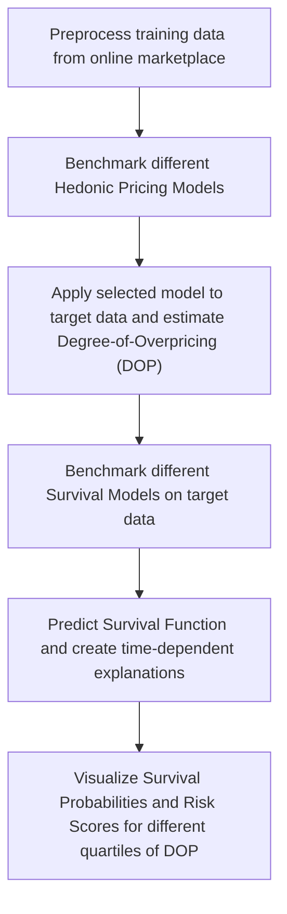

# Survival Analysis for Management Support in E-Commerce

**Type:** Master's Thesis

**Author:** Danyal Ahmed

**1st Examiner:** Prof. Dr. Stefan Lessmann

**2nd Examiner:** Prof. Dr. Benjamin Fabian

## Project Flowchart

## Table of Content

- [Abstract](#abstract)
- [Setup](#setup)
- [Usage](#usage)
- [Repository structure](-Repository-structure)

Code Repository for M.Sc. Thesis in Economics and Management Science at Humboldt-Universität zu Berlin.

## Abstract
In the past decade, we have seen the rise of numerous online marketplaces for used cars. This study explores the efficacy of combining survival analysis with model explanation frameworks to enhance the management system of online platforms. We extend the work done by Jerenz (2008) to estimate the demand function of used cars for a specific dealership using survival analysis. During the price and survival modelling stages, various models are evaluated to identify the key factors that impact demand. Finally, we apply the recently developed SurvSHAP(t) framework to derive key insights and recommendations for supporting online platforms.

## Setup

- Install Requirements
```bash
pip install -r requirements.txt
```

- This study was done in collaboration with a private sector entity and the data used can not be shared.


## Usage
- The complete project code is stored in `survival_modelling.ipynb`.
- Evaluate Pricing Models:
```python
from utilities import model_evaluation
from catboost import CatBoostRegressor

price_model = CatBoostRegressor(random_state=42).fit(X_train, y_train)
model_evaluation.reg_eval(price_model, X_test, y_test)
```
- Create time dependent explanations
```python
from utilities import survshap_util
from sksurv.ensemble import RandomSurvivalForest
from survshap import SurvivalModelExplainer, PredictSurvSHAP, ModelSurvSHAP
import matplotlib.pyplot as plt

#Fit survival model
surv_model = RandomSurvivalForest(random_state=42).fit(X,y)

#Create explanations
model_exp = SurvivalModelExplainer(surv_model, X, y)
global_rsf_exp = ModelSurvSHAP(random_state=42).fit(model_exp)

#Plot individual SHAP lines for feature 'DOP' and save
survshap_util.shap_lines_plot(global_rsf_exp.full_result, 'DOP')
plt.savefig('plots/dop_shap(t).png', transparent=True)
```
## Repository structure

```bash
├── README.md
├── requirements.txt                                -- required libraries
├── plots                                           -- stores image files
├── survival_modelling.ipynb                        -- full code application
└── utilities                                       -- helper functions
    ├── model_evaluation.py                           -- hedonic pricing model evaluation
    └── survshap_util.py                              -- create SurvShap plots               
```

